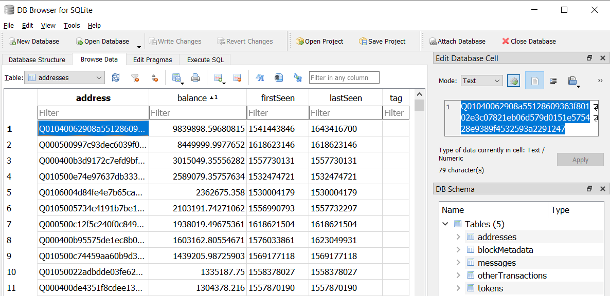
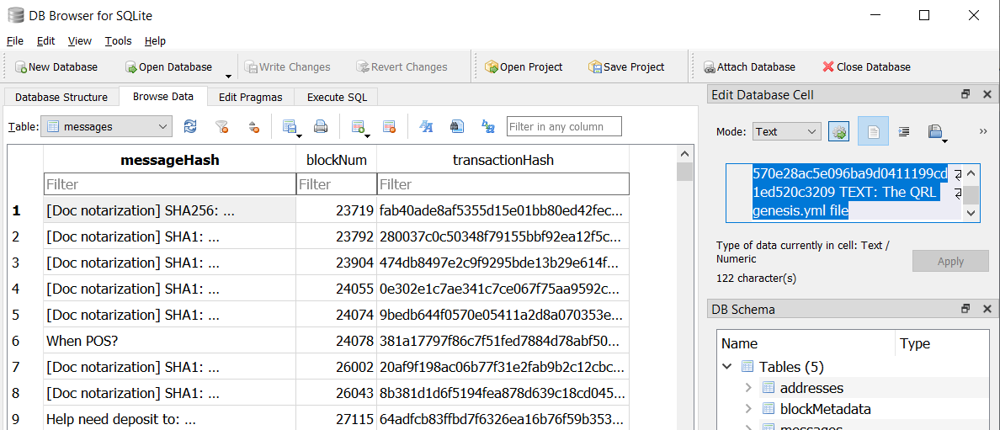
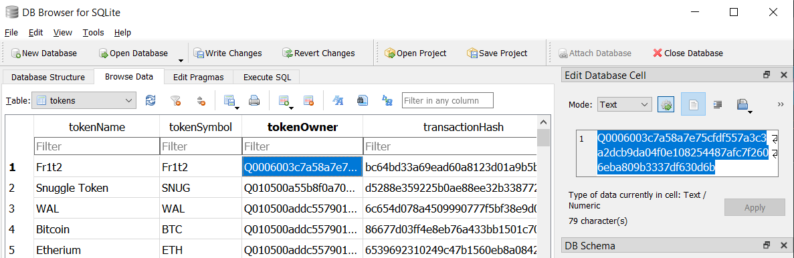

# QRL blockchain to SQLite

The [QRL](https://www.theqrl.org/) use LevelDB to store data. This project was created to convert QRL's blockchain into SQLite portable database format. 

After the conversion, rich list, all tokens created and all messages stored on the blockchain (including votes and document notarization) can easily be browsed.

## Samples

This repo includes [mainnet db converted](https://github.com/0xFF0/QRLtoSQLite/raw/main/samples/QRL_mainnet-1898738.zip) at blockheight 1898738 and [testnet db converted](https://github.com/0xFF0/QRLtoSQLite/raw/main/samples/QRL_testnet-25293.zip) at blockheight 25293.

[DB Browser for SQLite](https://sqlitebrowser.org/) can be used to browse them. 

  

  

  

## Generate SQLite DB

A [node](https://docs.theqrl.org/node/QRLnode/) is required to generate an SQLite database. 

1) Sync the entire blockchain to your computer.

2) Stop the node (the blockchain can't be accessed if it's locked by the node).

3) Use the python script to generate the SQLite database. 

		python3 QRLtoSqlite.py -i ~/.qrl/data/state/ -o QRL.sqlite

